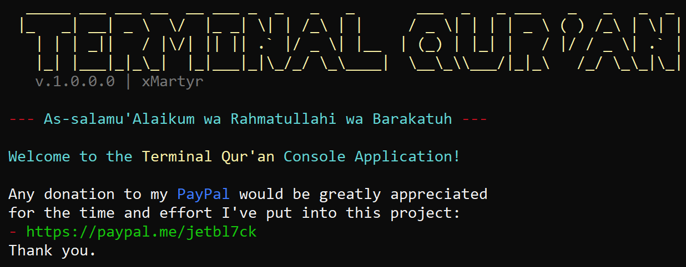

<p align="center">
  
</p>
# 🕋 Terminal Qur'an — `termoquran`

> 📥 **[Support my work](https://paypal.me/jetbl7ck)** – If you benefit from this tool, consider donating to help keep it alive and improving.

The Terminal Qur'an is a .NET 9 Console Application that provides Prayer Times and easy offline-access to the Holy Qur'an.

Features includes;
- get prayer times
- a list of the 99 names of Allah
- read the Qur'an by a simple index input
- search for verses with a prompt
- get random verses with an index

InSha'Allah (God Willing), that the application is beneficial to you in knowledge and truth.

---

<p align="center">
  
</p>

---

## 📦 Git Clone the Repository

```bash
git clone https://github.com/xMartyr/Terminal-Quran.git
```
```bash
cd Terminal-Quran
```

---

## ⚙️ Install .NET 9 on Linux

> Required to build and run `termoquran`.

### 🧪 Step-by-step:

```bash
sudo apt update -y && sudo apt upgrade -y
sudo apt install -y wget apt-transport-https software-properties-common
```
# Add Microsoft package signing key
```bash
wget https://packages.microsoft.com/config/ubuntu/$(lsb_release -rs)/packages-microsoft-prod.deb -O packages-microsoft-prod.deb
sudo dpkg -i packages-microsoft-prod.deb
rm packages-microsoft-prod.deb
```
# Install the .NET 9 SDK
```bash
sudo apt update -y && apt install -y dotnet-sdk-9.0
```

---

## 🛠️ Build the Project

```bash
dotnet build -c Release
```

This will generate the output in:

```bash
./bin/Release/net9.0/
```

You can now run it manually:

```bash
./bin/Release/net9.0/termoquran
```

---

## 🌍 Optional: Install Globally on Linux

To make `termoquran` available system-wide:

```bash
sudo cp ./bin/Release/net9.0/termoquran /usr/local/bin/termoquran
```

Now just run it from anywhere:

```bash
termoquran
```

---

## ✅ Uninstall (if needed)

```bash
sudo rm /usr/local/bin/termoquran
```

---

## ☕ Contribute

Pull requests are welcome. For major changes, please open an issue first.

---

## 🙏 Bismillah

May this tool be beneficial. Feel free to fork, contribute, and share.
---

### ❤️ Enjoying Terminal Qur'an?

> 🕋 Support future Islamic open-source projects:
> 👉 [paypal.me/jetbl7ck](https://paypal.me/jetbl7ck)

---

<p align="center">
  
</p>

---
